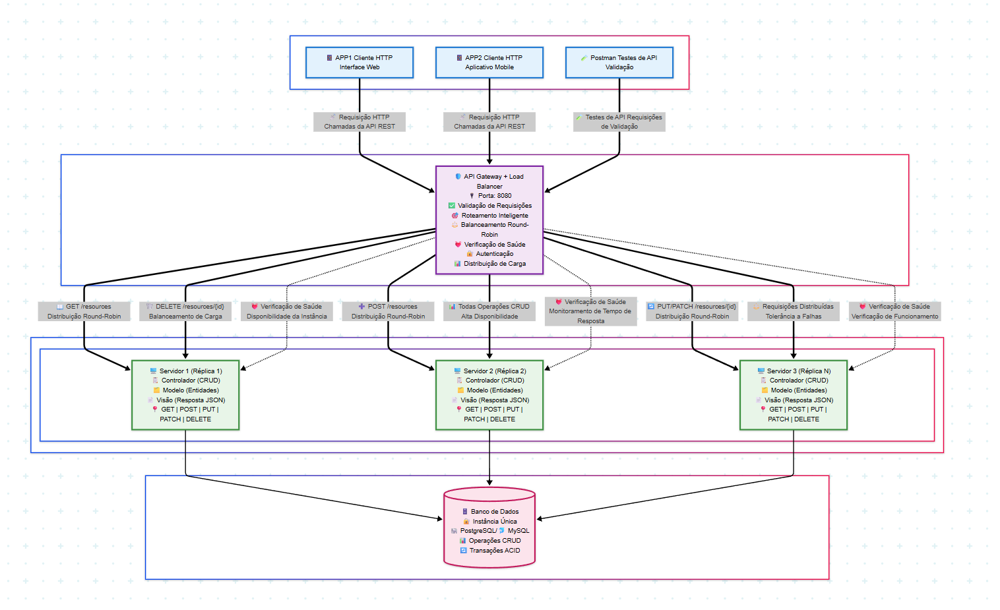

# API Service

Este repositório contém a implementação de um serviço de API RESTful com operações de CRUD (Create, Read, Update, Delete) integradas a um banco de dados.

</img>

## Equipe do Projeto

| Nome              | Responsabilidade                 |
|-------------------|----------------------------------|
| Arthur Nascimento | Refinamento da API Gateway e Model na API Services      |
| Hellan Lins       | Lógica de Insert na API Services          |
| Alexandre Veloso  | Lógica de Update na API Services                 |
| Calebe Xavier         | Lógica de Select na API Services   |
| Victor Martins         | Lógica de Delete na API Services   |


## Funcionalidades

A API fornece os seguintes endpoints com suas respectivas funções:

- **GET**: Retorna todos os registros ou um registro específico do banco de dados.
- **POST**: Insere um novo registro no banco de dados.
- **PUT / PATCH**: Atualiza registros existentes (todos ou parcialmente).
- **DELETE**: Remove um registro do banco de dados.

## Uso de códigos de status HTTP:

- **200 OK**: Sucesso
- **201 Created**: Recurso criado com sucesso
- **400 Bad Request**: Erro na requisição
- **401 Unauthorized**: Falta de autenticação
- **404 Not Found**: Recurso não encontrado
- **500 Internal Server Error**: Erro no servidor

## Configuração(.env)

- DATABASE_URL= 
- PORT= 

### Pré-requisitos

- Node.js instalado (versão 16 ou superior).
- Gerenciador de pacotes `npm`

### Instalação

1. Clone o repositório:
   ```bash
   git clone https://github.com/seu-usuario/api_services.git
   cd API_Gateway
   npm install
   npm run dev
   ```

## 🧪 Para testar com o Postman
Você pode testar os endpoints usando o Postman, seguindo os passos abaixo:

1. Inicie o servidor localmente (ex: http://localhost:3000)

2. Exemplos de requisições:

### 🔹 GET - Listar registros
      - URL: http://localhost:3000/resources
      - Método: GET
      - Descrição: Retorna todos os usuários cadastrados.

### 🔹 GET - Buscar por id
      - URL: http://localhost:3000/resources/:id
      - Método: GET
      - Descrição: Retorna um registro baseado no id.

### 🔹 POST - Criar registro
      - URL: http://localhost:3000/resources
      - Método: POST
      - Body (JSON):
   
      {
          "status": "Confirmado",
          "nome": "Show de Rock",
          "data_inicio": "2023-12-15T20:00:00.000Z",
          "data_fim": "2023-12-15T23:00:00.000Z",
          "local_id": 1,
          "preco_entrada": "50.00",
          "descricao": "Apresentação da banda local",
          "imagem_url": "https://exemplo.com/imagens/show.jpg"
      }

### 🔹 PUT - Atualizar registro
      - URL: http://localhost:3000/resources/:id
      - Método: PUT
      - Body (JSON):
      {
          "status": "Cancelado",
          "nome": "Show Gospel (editado - put)",
          "data_inicio": "2023-12-15T20:00:00.000Z",
          "data_fim": "2023-12-15T23:00:00.000Z",
          "local_id": 1,
          "preco_entrada": "50.00",
          "descricao": "Apresentação da banda local (editado - put)",
          "imagem_url": "https://exemplo.com/imagens/show.jpg"
      }

### 🔹 PATCH - Atualizar registro parcialmente
      - URL: http://localhost:3000/resources/:id
      - Método: PATCH
      - Body (JSON):
      {
          "status": "Cancelado",
          "nome": "Brasil x Argentina (editado parcialmente - patch)",
          "data_inicio": "2023-12-15T20:00:00.000Z",
          "data_fim": "2023-12-15T23:00:00.000Z",
          "local_id": 1,
          "preco_entrada": "50.00",
          "descricao": "Apresentação da banda local (editado - put)",
          "imagem_url": "https://exemplo.com/imagens/show.jpg"
      }

### 🔹 DELETE - Remover registro
      - URL: http://localhost:3000/resources/:id
      - Método: DELETE
